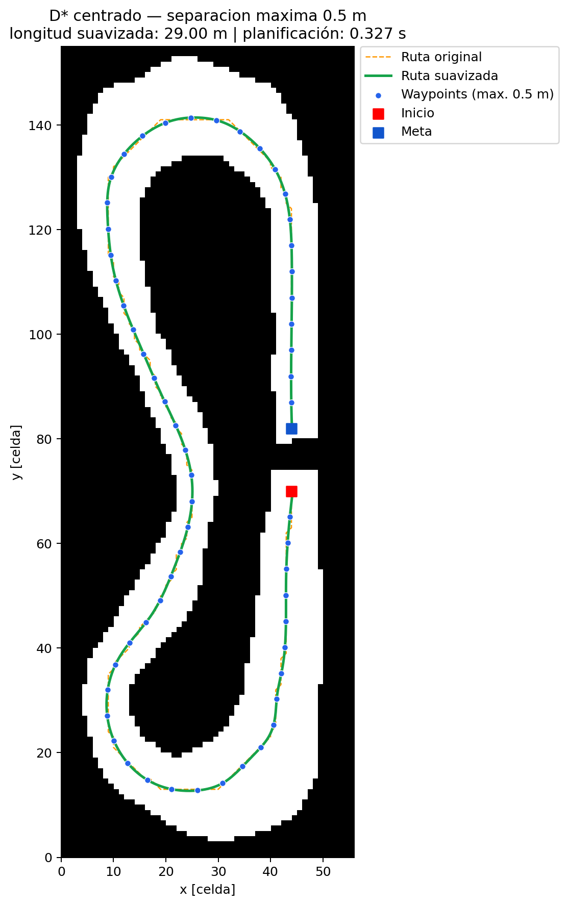
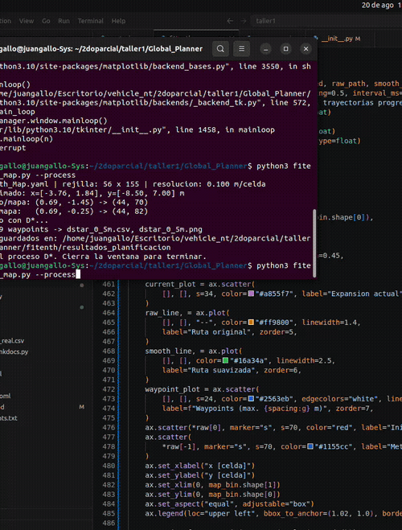
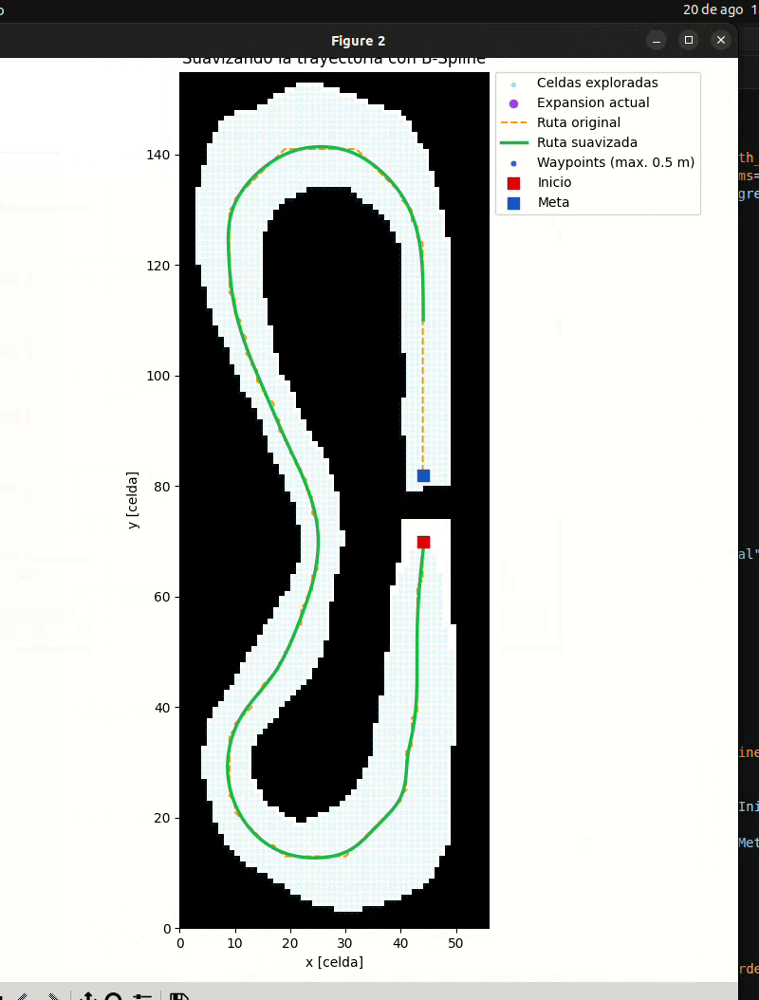
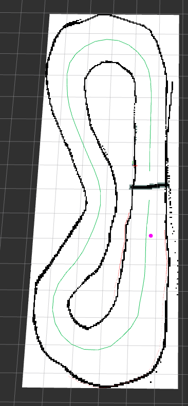

# Planificador global D* para F1TENTH con ROS 2 y AutoDRIVE

Proyecto de planificación global para un vehículo F1TENTH sobre un mapa 2D
obtenido con SLAM Toolbox. El sistema calcula una vuelta completa mediante
**D\***, suaviza la ruta con una **B-Spline cúbica**, genera waypoints con una
separación máxima de `0.5 m` y publica el resultado como `nav_msgs/Path` para
visualizarlo sobre el mapa y el vehículo de AutoDRIVE en RViz.

El repositorio incluye el mapa `F1tenth_Map.pgm/.yaml`, el planificador, las
pruebas, el CSV final, el paquete ROS 2, el bridge de AutoDRIVE corregido y las
evidencias visuales. 

## Resultado

| Métrica | Resultado validado |
|---|---:|
| Algoritmo global | D* (Dynamic A*) |
| Suavizado | B-Spline cúbica |
| Longitud de ruta discreta | 30.09 m |
| Longitud de ruta suavizada | 29.00 m |
| Waypoints exportados | 59 |
| Separación máxima | 0.5 m |
| Tiempo de planificación de referencia | 0.327 s |

El tiempo depende del computador utilizado; las demás métricas corresponden
a los archivos incluidos en el repositorio.

## Evidencias

### Ruta discreta frente a ruta suavizada



### Proceso del planificador global

La animación muestra la expansión de D*, la reconstrucción de la ruta, el
suavizado B-Spline y la colocación final de los waypoints.



[](assets/dstar_planning_process.webm)

Haz clic en la imagen anterior para abrir la grabación original en formato
WebM.

### Proceso de mapeado con SLAM

El mapa base del circuito se generó con SLAM Toolbox a partir de las lecturas
LiDAR del vehículo. Durante la adquisición se registraron las poses, se fusionó
el mapa en 2D y se corrigieron inconsistencias de entorno para exportar la
versión final en formato PGM/YAML lista para la planificación global.

https://youtu.be/ci9kzYN7z2Y

### Path superpuesto en RViz

RViz muestra el mapa y únicamente la línea verde de la ruta suavizada, con un
grosor configurado de `0.20 m`.



[Ver captura ampliada de RViz](assets/rviz_global_path_zoom.png)

## Algoritmos y modificaciones realizadas

### Planificación D*

La implementación asignada se encuentra en
`Global_Planner/python_motion_planning/global_planner/graph_search/d_star.py`.
Para este proyecto se añadieron:

- detección explícita de casos sin solución;
- control de entradas duplicadas en la lista `OPEN`;
- un mapa de distancia a obstáculos;
- penalización configurable por cercanía a las paredes;
- preferencia por el centro transitable de la pista.

### Procesamiento del mapa

`Global_Planner/f1tenth/f1tenth_map.py` realiza el flujo completo:

1. Lee el PGM y el YAML del mapa ROS.
2. Considera como ocupadas las paredes y las zonas desconocidas.
3. Infla obstáculos de acuerdo con el radio de seguridad.
4. Reduce la rejilla mediante *max-pooling*, sin eliminar paredes delgadas.
5. Conserva únicamente la región transitable conectada con el inicio.
6. Ejecuta D* con penalización de proximidad a paredes.
7. Suaviza la ruta mediante una B-Spline cúbica.
8. Verifica la curva contra obstáculos.
9. Exporta waypoints en metros con separación máxima de `0.5 m`.

### Integración con ROS 2

El paquete `f1tenth_global_path`:

- publica el mapa en `/map` mediante `nav2_map_server`;
- publica la trayectoria en `/global_path` como `nav_msgs/msg/Path`;
- usa el frame global `map`;
- carga una configuración de RViz que muestra solo la línea de la ruta;
- incluye el mapa y el CSV dentro del propio paquete.

El bridge `autodrive_f1tenth` fue ajustado para crear una sola instancia de
`tf2_ros.TransformBroadcaster`. Esto evita la creación continua de publishers
TF y permite publicar de manera estable la transformación:

```text
map -> f1tenth_1
```

La traslación se obtiene del IPS y la orientación del IMU de AutoDRIVE.

## Variables principales

| Variable | Valor por defecto | Descripción |
|---|---:|---|
| `--start` | `0.69 -1.45` | Inicio de la vuelta, en metros |
| `--goal` | `0.69 -0.25` | Meta después de completar la vuelta |
| `--downsample` | `2` | Factor de reducción de la rejilla |
| `--robot-radius` | `0.15 m` | Inflado de seguridad de obstáculos |
| `--clearance-weight` | `20.0` | Penalización D* cerca de paredes |
| Separación de waypoints | `0.5 m` | Distancia máxima entre puntos |
| Frame global | `map` | Referencia del mapa y del Path |
| Publicación del Path | `1 Hz` | Periodo predeterminado del nodo ROS |
| Grosor en RViz | `0.20 m` | Ancho visual de la línea verde |

El mapa tiene resolución original de `0.05 m/pixel`, origen
`[-3.76, -8.5, 0.0]` y un rango aproximado de `x=[-3.76, 1.84] m` y
`y=[-8.50, 7.00] m`.

## Estructura del repositorio

```text
.
├── assets/                         # Imágenes, GIF y video de evidencia
├── Global_Planner/
│   ├── Mapas-F1Tenth/              # F1tenth_Map.pgm y F1tenth_Map.yaml
│   ├── f1tenth/
│   │   ├── f1tenth_map.py          # Ejecución completa de la Parte B
│   │   └── resultados_planificacion/
│   ├── python_motion_planning/      # D* y utilidades de planificación
│   ├── tests/                       # Pruebas automáticas
│   └── requirements-f1tenth.txt
└── autodrive_ws/
    ├── requirements.txt             # Dependencias Python del bridge
    └── src/
        ├── autodrive_ros2/
        │   └── autodrive_f1tenth/   # Bridge F1TENTH corregido
        └── f1tenth_global_path/     # Mapa, Path, launch y configuración RViz
```

No se versionan `build/`, `install/`, `log/`, `venv/` ni `__pycache__/`.

## Requisitos

Entorno utilizado y validado:

- Ubuntu 22.04;
- ROS 2 Humble Desktop;
- Python 3.10;
- AutoDRIVE Simulator con el vehículo F1TENTH;
- Git y `colcon`;
- interfaz gráfica compatible con RViz y Matplotlib.

La instalación oficial de ROS 2 Humble está disponible en
[docs.ros.org](https://docs.ros.org/en/humble/Installation/Ubuntu-Install-Debs.html).
El simulador se obtiene desde el proyecto
[Tinker-Twins/AutoDRIVE](https://github.com/Tinker-Twins/AutoDRIVE).

## Instalación desde cero

### 1. Clonar el repositorio

```bash
git clone <URL_DEL_REPOSITORIO> entrega_f1tenth
cd entrega_f1tenth
```

Todos los comandos siguientes se ejecutan desde esta carpeta, salvo cuando se
indique lo contrario.

### 2. Instalar dependencias del sistema y ROS 2

Con ROS 2 Humble ya instalado:

```bash
sudo apt update
sudo apt install -y \
  python3-colcon-common-extensions \
  python3-pip \
  python3-rosdep \
  python3-venv \
  libgl1 \
  ros-humble-cv-bridge \
  ros-humble-nav2-lifecycle-manager \
  ros-humble-nav2-map-server \
  ros-humble-rviz2 \
  ros-humble-rviz-imu-plugin \
  ros-humble-tf-transformations
```

Si `rosdep` todavía no está inicializado en el equipo, ejecutar una sola vez:

```bash
sudo rosdep init
rosdep update
```

Si `sudo rosdep init` informa que ya existe una configuración, basta con
ejecutar `rosdep update`.

### 3. Crear el entorno del planificador

```bash
cd Global_Planner
python3 -m venv venv
source venv/bin/activate
python -m pip install --upgrade pip setuptools wheel
python -m pip install -r requirements-f1tenth.txt
deactivate
cd ..
```

Este entorno contiene únicamente las dependencias necesarias para el mapa,
D*, B-Spline, generación de CSV, pruebas y visualización Matplotlib.

### 4. Preparar el entorno del bridge AutoDRIVE

El launch busca intencionalmente un entorno llamado `venv` en la raíz de
`autodrive_ws`.

```bash
cd autodrive_ws
python3 -m venv --system-site-packages venv
source venv/bin/activate
python -m pip install --upgrade pip setuptools wheel
python -m pip install -r requirements.txt
deactivate
touch venv/COLCON_IGNORE
```

`--system-site-packages` permite que el bridge use `rclpy`, `cv_bridge` y los
mensajes instalados por ROS 2, mientras el launch añade las dependencias WebSocket
del entorno virtual.

### 5. Resolver dependencias y compilar ROS 2

```bash
source /opt/ros/humble/setup.bash
rosdep install --from-paths src --ignore-src -r -y
colcon build --symlink-install \
  --base-paths src \
  --packages-select autodrive_f1tenth f1tenth_global_path
source install/setup.bash
cd ..
```

El repositorio puede ubicarse en cualquier ruta; el launch calcula la ubicación
del entorno virtual a partir del prefijo instalado.

## Ejecución

### Generar nuevamente la planificación

```bash
cd Global_Planner
source venv/bin/activate
python3 f1tenth/f1tenth_map.py
```

Los resultados se guardan en
`Global_Planner/f1tenth/resultados_planificacion/`.

Para mostrar la comparación final:

```bash
python3 f1tenth/f1tenth_map.py --show
```

Para visualizar el proceso progresivo utilizado en la evidencia:

```bash
python3 f1tenth/f1tenth_map.py --show --process
```

Las coordenadas y parámetros pueden modificarse desde la terminal sin editar
el código:

```bash
python3 f1tenth/f1tenth_map.py \
  --start 0.69 -1.45 \
  --goal 0.69 -0.25 \
  --robot-radius 0.15 \
  --downsample 2 \
  --clearance-weight 20
```

Agregar `--include-rrt` ejecuta RRT únicamente como comparación adicional; D*
sigue siendo el algoritmo asignado.

### Lanzar AutoDRIVE, el mapa, el Path y RViz

No debe existir otro bridge usando el puerto `4567`. Si hay otro launch activo,
detenerlo primero con `Ctrl+C`.

```bash
cd autodrive_ws
source /opt/ros/humble/setup.bash
source install/setup.bash
ros2 launch f1tenth_global_path autodrive_path.launch.py
```

Con el launch activo:

1. Abrir AutoDRIVE Simulator.
2. Seleccionar el entorno y el vehículo F1TENTH correspondientes al mapa.
3. Iniciar o conectar la simulación con el bridge ROS 2.
4. Esperar a que RViz muestre `/map` y la línea verde de `/global_path`.

El launch inicia en conjunto:

- `autodrive_incoming_bridge`;
- `autodrive_outgoing_bridge`;
- `nav2_map_server`;
- `nav2_lifecycle_manager`;
- `f1tenth_global_path_publisher`;
- RViz con la configuración incluida.

## Verificación

En otra terminal:

```bash
cd autodrive_ws
source /opt/ros/humble/setup.bash
source install/setup.bash
ros2 topic list
```

Comprobar el mapa y el Path:

```bash
ros2 topic echo /map --once
ros2 topic echo /global_path --once
```

Comprobar la pose del vehículo:

```bash
ros2 run tf2_ros tf2_echo map f1tenth_1
```

La salida debe actualizar una transformación con traslación y cuaternión. Es
normal que aparezca brevemente `Invalid frame ID "map"` antes de recibir el
primer paquete del simulador; después deben mostrarse las transformaciones.

### Ejecutar las pruebas del planificador

```bash
cd Global_Planner
source venv/bin/activate
MPLBACKEND=Agg python3 -m unittest discover -s tests -v
```

Las pruebas comprueban:

- selección y metadatos del mapa;
- generación de la vuelta completa;
- margen respecto de las paredes;
- ausencia de colisiones en la ruta B-Spline;
- separación y validez de los waypoints;
- rechazo de coordenadas fuera del mapa.

## Archivos producidos

| Archivo o tópico | Contenido |
|---|---|
| `dstar_0_5m.csv` | 59 waypoints `x,y` expresados en metros |
| `dstar_0_5m.png` | Ruta discreta, B-Spline y waypoints |
| `resumen.csv` | Tiempo, longitudes y cantidad de puntos |
| `/map` | `nav_msgs/msg/OccupancyGrid` |
| `/global_path` | `nav_msgs/msg/Path` en el frame `map` |
| `/tf` | Transformación dinámica `map -> f1tenth_1` |

El paquete ROS incluye una copia validada del CSV. Si se cambian inicio, meta o
parámetros y se desea visualizar la nueva ruta, copiar el nuevo resultado y
recompilar:

```bash
cp Global_Planner/f1tenth/resultados_planificacion/dstar_0_5m.csv \
  autodrive_ws/src/f1tenth_global_path/paths/dstar_0_5m.csv

cd autodrive_ws
source /opt/ros/humble/setup.bash
colcon build --symlink-install --base-paths src \
  --packages-select f1tenth_global_path
source install/setup.bash
```

Este paso no es necesario para ejecutar la configuración entregada.

## Solución de problemas

### `Package 'f1tenth_global_path' not found`

```bash
cd autodrive_ws
source /opt/ros/humble/setup.bash
source install/setup.bash
```

Si `install/setup.bash` no existe, repetir la compilación de la sección de
instalación.

### `No module named gevent`, `socketio` o `geventwebsocket`

El entorno debe llamarse exactamente `autodrive_ws/venv`:

```bash
cd autodrive_ws
source venv/bin/activate
python -m pip install -r requirements.txt
deactivate
```

### `Address already in use` en el puerto 4567

Ya existe otro bridge de AutoDRIVE ejecutándose. Cerrar el launch anterior con
`Ctrl+C` y ejecutar únicamente `autodrive_path.launch.py`.

### RViz no muestra la ruta

Verificar que `Fixed Frame` sea `map`, que el display `Ruta D* suavizada` esté
activo y que `/global_path` publique mensajes.

### Problemas con el daemon de ROS 2

```bash
ros2 daemon stop
ros2 daemon start
```

Después volver a comprobar `/tf` con `tf2_echo`.

## Licencias y atribución

La biblioteca base `python_motion_planning` conserva su licencia y atribución
original dentro de `Global_Planner/LICENSE`. El bridge de AutoDRIVE conserva
los encabezados BSD originales de Tinker Twins. Las modificaciones específicas
del proyecto y el paquete `f1tenth_global_path` se entregan con los archivos de
fuente incluidos en este repositorio.
